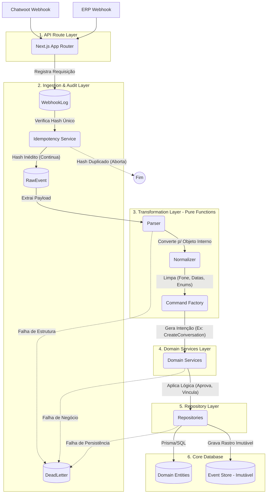
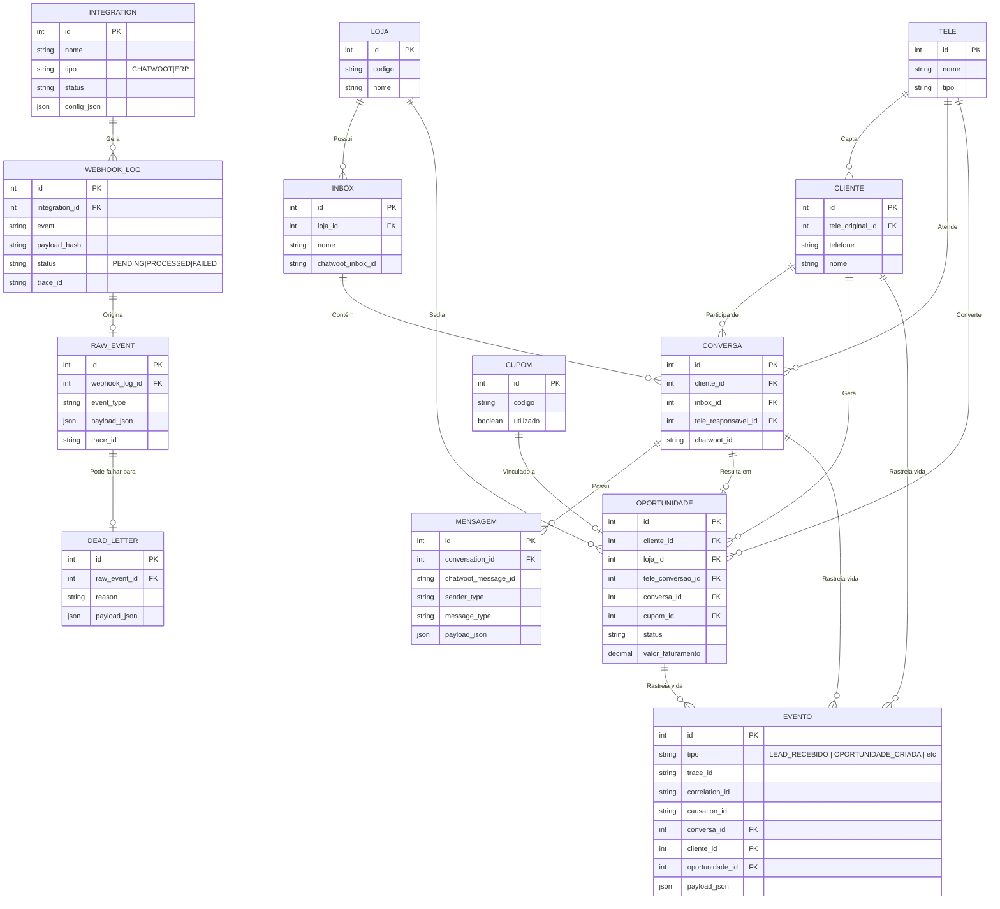

# Diagramas de Arquitetura Final - Sprint 1 (Versão Congelada)

Conforme sua última orientação para a IDE, antes de iniciarmos qualquer codificação do domínio, apresentamos os diagramas arquiteturais para validação final.

## 1. Diagrama de Fluxo e Camadas (CQRS/Event-Driven)

Este diagrama representa a jornada estrita e obrigatória de um dado ao entrar no sistema (via Webhook) até se tornar um registro consolidado no Banco de Dados.

---

## 2. Relacionamento entre as Entidades (Domain & Audit)

A modelagem de dados incorpora rigorosamente a rastreabilidade via `Integration`, o isolamento entre `Inbox` e `Loja`, o Event Sourcing (`Evento`) e o log de falhas (`DeadLetter`).

## User Review Required

> [!IMPORTANT]
> Avalie os diagramas Mermaid acima. O fluxo em 6 camadas restritas e os relacionamentos de domínio refletem exatamente a sua especificação? Após a aprovação, criaremos o repositório Next.js, geraremos os `.md` documentais e as migrações do Prisma com o Repository Pattern e Event Sourcing V1 final.
